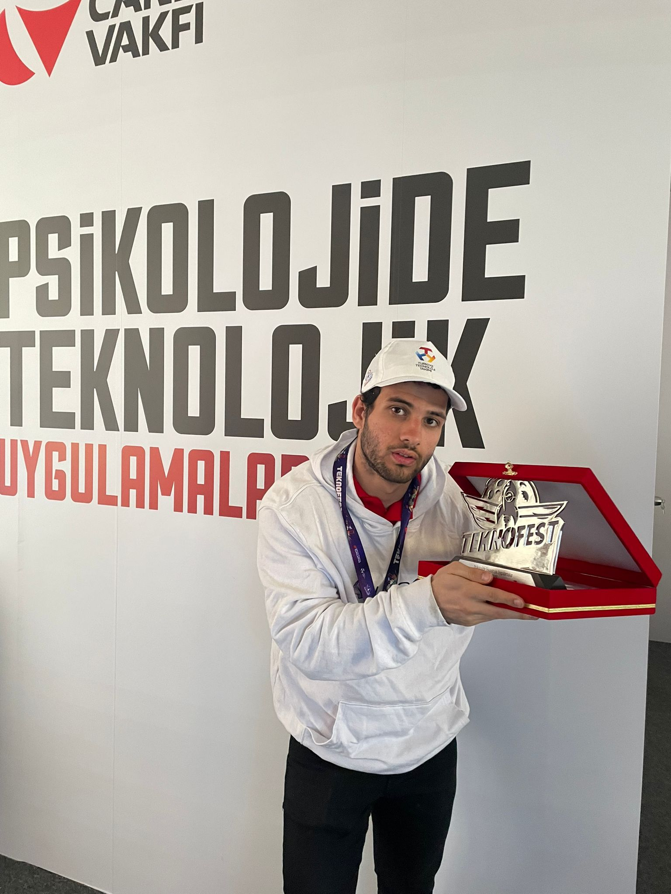

 

I'm an enthusiastic AI engineer. Welcome to my GitHub haven, where I share my passion for AI, coding adventures, and a bit of my personal interests.

**About me**

- 💼 AI Engineer at <b>[Üniteks](https://www.uniteks.com.tr/)</b>

- ❤️ I love writing Python

<code></code>
<code></code>
<code></code>
<code></code>
<code></code>    
